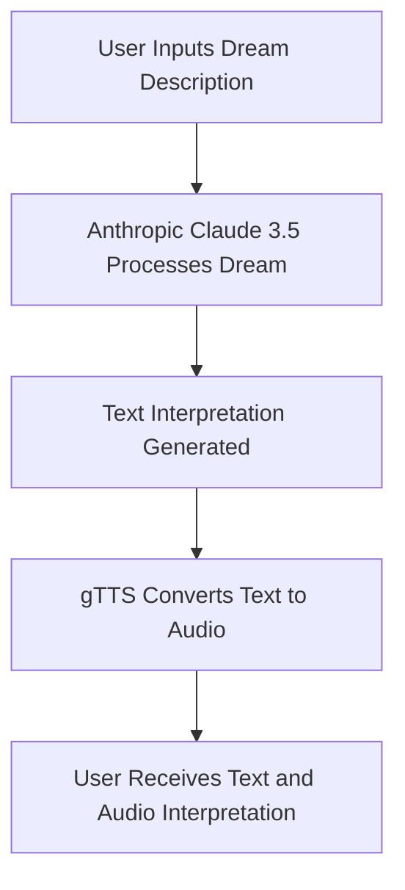

# DreamChronicle

**DreamChronicle** is an AI-powered app designed to interpret dreams by transforming user-inputted dream descriptions into insightful text and audio results. This project leverages cutting-edge technologies, including Anthropic Claude 3.5 (LLM) for dream interpretation and Google Text-to-Speech (gTTS) for audio conversion, to offer a unique and personalized dream interpretation experience.

DreamChronicle was developed during the **"Aspire Pakistan Innovators Hackathon"** to address the common challenge many people face in understanding their dreams. By entering a dream description into the app, users receive a detailed interpretation in both text and audio formats. The app uses the Anthropic Claude 3.5 model, fine-tuned with psychological theories and cultural insights, to analyze dreams and connect them with shared human experiences. The interpretation is also converted into audio using the gTTS model for a more immersive experience.

## Technology Stack

- **Frontend:** Streamlit
- **Backend:** Python
- **AI/ML Models:**
  - **Anthropic Claude 3.5:** Large Language Model (LLM) for dream interpretation
  - **gTTS:** Google Text-to-Speech for audio conversion
- **Deployment:** Streamlit
- **Version Control:** Git
- **Project Management:** GitHub Issues, GitHub Projects

## Installation

### Prerequisites

- Python 3.x
- Pip (Python package manager)
- Virtual environment (recommended)

### Steps

1. **Clone the Repository:**

   ```bash
   git clone https://github.com/Muhammad-Qasim-Jamil/dreamchronicle.git
   cd dreamchronicle
   ```

2. **Create a Virtual Environment:**

   ```bash
   python -m venv venv
   source venv/bin/activate  # On Windows use `venv\Scripts\activate`
   ```

3. **Install Dependencies:**

   ```bash
   pip install -r requirements.txt
   ```

4. **Run the Application:**

   ```bash
   streamlit run app.py
   ```

5. **Access the App:**

   The app will automatically open in your web browser. If not, go to `http://localhost:8501` to view it.

## Usage

1. **Enter Dream Description:**
   - Type your dream description into the provided input field.

2. **Get Interpretation:**
   - Click the "Generate" button to receive a detailed analysis in both text and audio.

## Flowchart

Here's a basic overview of how DreamChronicle works:



## Future Enhancements

- **Personalized Dream Journals:** Offer users the ability to maintain personalized dream journals with detailed insights and trends.
- **VR Integration:** Explore the possibility of integrating Virtual Reality (VR) for immersive dream exploration experiences.
- **Advanced Analytics:** Use AI to analyze large datasets of dream descriptions, identifying patterns and providing deeper insights.

## Team

- **Hamza Saeed:** Team Leader
- **Salman Maqbool:** Frontend Developer
- **Mohammad Qasim Jamil:** Backend Developer, AI/ML Integration
- **Yameen Mohsin:** Audio Processing & Deployment

## Acknowledgments

- **Zafar Shahid, PhD** and **Rizwan Ghaffar** for their mentorship and support.
- **Hackathon Organizers:** Aspire Pakistan and iCodeGuru for providing the platform to innovate and collaborate.
